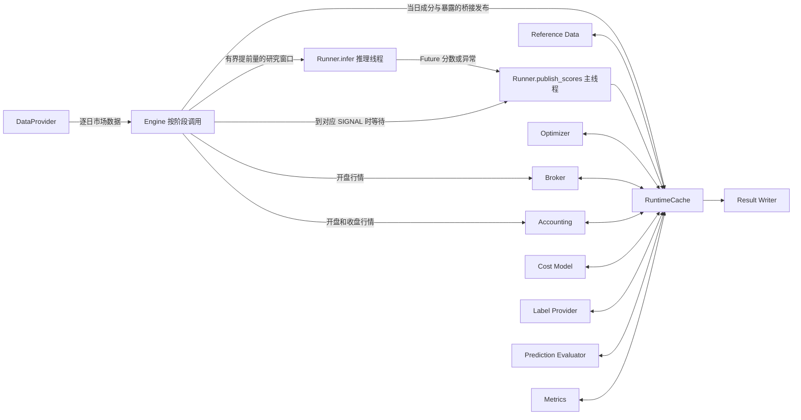

# 组件接口协议与运行缓存

本文是组件间接口的独立设计依据，需求以 [只读开发规格](../BACKTEST_PLATFORM_SPEC_v2.md) 为准；现有实现状态见 [实现设计与开发](design.md)。

**状态：公共接口协议版本 3，标准提交与正式优化器已接入。** 缓存、异步推理、组合构建、交易、费用、估值、外部参考数据、标签、评价及文件输出共用本文协议。实现与验收范围见实现设计文档。

## 1. 交互边界

保留现有市场数据流：DataProvider 按交易日交付开盘行情、收盘行情和截至信号日的研究窗口。市场数据的读取、预取、历史切片和价格参考状态仍由 DataProvider 管理。

新增单次回测内的内存缓存 `RuntimeCache`，承载市场数据流以外的共享数据：

- 账户阶段快照、实际权重和收盘基准；
- 当前成分、Barra 暴露、指数权重、行业和基准收益；
- 模型分数、下一执行日目标、订单、成交与每日核算结果；
- 计费请求与结果；
- 事后标签、预测评价、最终指标及结构化运行记录。

这里的“缓存”是组件间数据交换和运行状态的持有者。账户状态是本次运行的权威状态，不能因容量策略而任意淘汰。缓存不做金融计算、不加载数据文件、不调用组件、不持有组件对象或可执行回调。

Engine 负责实例化组件和推进执行顺序。它直接传递市场数据和控制参数；组件通过缓存读写其他数据，不把账户、权重、费用或评价结果作为跨业务组件函数参数或返回值传递。分数在推理线程与主线程之间通过 Future 内部交接，再由 Runner 发布到缓存；Optimizer、Evaluator 等业务读者仍只通过缓存获得分数。

账户和缓存按确定顺序由主线程推进；“并行实现”仍指各开发任务独占文件。运行时另有独立的行情预取线程和单个推理线程，两者都不访问运行缓存。模型按信号日期顺序执行，允许领先账户一个调仓间隔；市场日包缓冲上限为 rebalance_interval + 1，最多两个信号推理作业。使用标准库 deque、Future 和 ThreadPoolExecutor，不引入外部服务或通用事件调度框架。



参赛者的 `InferenceModel.predict(as_of_date, data)` 接口保持不变。Runner 的推理入口不访问缓存，发布入口只在主线程使用缓存；绝不把缓存、账户、组件句柄或标签传给参赛模型。

## 2. 通用数据约定

| 项目 | 协议 |
|---|---|
| 运行隔离 | 每次 `run()` 创建新缓存实例；不能跨队伍、跨运行复用状态 |
| 日期 | 协议字段使用 `YYYY-MM-DD`；原始研究窗口保持源数据的整数日期和中文列名 |
| 股票代码 | 保留 `SH`/`SZ` 前缀；表内代码与索引不得混用不同格式 |
| 表格键 | 日截面通常以 `date, code` 唯一；特殊主键见各数据结构 |
| 数值 | 金额、收益、费率和权重使用有限浮点数；费率、收益和权重均为小数 |
| 股数 | 真实价格模式使用非负整数；后复权收益模式不构造真实股数 |
| 空值 | 可空字段用 `None`/pandas 缺失值，导出 JSON 时为 `null`；不输出 NaN/Inf 数字字面量 |
| 顺序 | 截面按代码稳定排序；订单先 SELL 后 BUY，同方向按代码排序；不得依赖 set 的遍历次序 |
| 配置 | 运行开始后不可变；组件不得通过修改配置影响其他组件 |
| 数据所有权 | 每个主题只有一个生产者；发布后共享只读借用引用 |
| 日期选择 | 消费者必须指定确切日期或请求键，禁止用“最新一条”代替业务要求的时点 |

三种状态必须区分：

1. 缓存没有该键：生产者尚未完成，或该阶段按日历不应生成；必需读取失败即为协议错误。
2. 已发布空表：生产者已完成，确认结果为空；表仍有完整字段。
3. 数据源不可用：通过 `Dataset(status="unavailable", data=None, reason=...)` 显式发布，不能冒充空表。

外部参考数据统一使用 `Dataset[T]`：

```text
status: "available" | "unavailable"
data: T | None
reason: str | None
```

`available` 必须携带数据对象，允许完整字段的空表，`reason=None`。`unavailable` 必须说明原因。一个已声明可用的数据源若缺失必需日期或关键记录，应抛出数据错误，不能逐日静默降级。股票停牌、单股行情缺失仍按行情字段表达，不等于整套数据源不可用。

## 3. RuntimeCache 接口

以下签名约定调用方式；具体数据类和主题常量由共享协议文件定义。

```python
class RuntimeCache:
    def __init__(self, *, context: RunContext): ...
    def for_component(self, role: ComponentRole) -> CacheView: ...
    def advance(self, *, date: str | None, phase: Phase) -> None: ...
    def finish_day(self, *, date: str) -> None: ...
    def close(self) -> None: ...

class CacheView:
    def contains(self, topic: Topic, key: CacheKey = None) -> bool: ...
    def read(self, topic: Topic, key: CacheKey = None) -> object: ...
    def publish(self, topic: Topic, key: CacheKey, value: object) -> None: ...
    def history(self, topic: Topic, *, date: str | None = None) -> pd.DataFrame: ...
    def result_tables(self) -> dict[str, pd.DataFrame]: ...
    def finish_quote(self, *, date: str, request_id: int) -> None: ...
    def log(self, *, level: str, message: str, details: dict | None = None) -> None: ...
    def log_records(self, *, after_seq: int) -> list[LogRecord]: ...
```

- `CacheKey` 为主题登记的 `None`、日期字符串或 `(date, request_id)`；缓存实例已限定运行，不额外拼接全局运行键。
- `for_component()` 返回固定角色视图。组件只持有自己的视图，不能取得其他角色或底层可变存储。权限表由本文主题表确定；不向业务组件开放任意键枚举。
- `contains()` 也受读权限约束。它只用于判断有无排期目标等允许缺席的数据，不能绕过必需输入校验。
- `publish()` 验证角色、阶段、键及关联日期后，直接保存数据包引用，不递归克隆。每种固定表结构只在本次运行首次出现时验证一次；同一账户表、股票池或 Barra 表在后续阶段复用时不再检查结构。失败时该包不生效。
- 同一主题、同一键只允许发布一次。发布成功即交出修改权，生产者和读者都不得再原地修改该包及嵌套的 DataFrame、dict、对象单元格；`read()` 返回原对象的借用引用。新阶段只为确实改变的表或字段建立新对象，未变部分共享。
- `read()` 对未发布的必需键抛出 `KeyError`，权限错误抛出 `PermissionError`，字段或关联错误抛出 `ValueError`，数据包类型错误抛出 `TypeError`，非法阶段和重复发布抛出 `RuntimeError`；不等待、不自动重试。
- 缓存负责协议交接及一次性表结构检查，不重复逐表扫描主键、空值和行日期。主键唯一、行日期正确、账户平衡及费用计算由唯一生产者保证；Runner 在本次运行首个信号日检查模型输出结构，每批仍验证分数值、日期和股票池覆盖。缓存保留阶段/权限、数据包日期、执行排期、计费身份等会随运行改变的检查。首次校验后，生产者必须维持固定结构；缓存不再主动检测后续结构漂移。
- `history()` 仅开放 `signal.scores` 的分数历史，Label Provider 与 Evaluator 只能在 EVALUATION 阶段读取，可按信号日期筛选。其他主题不提供历史查询。
- `result_tables()` 在评价结果完成后开放给 Metrics、Result Writer 和 Engine；七张表首次读取时合并一次，后续共享同一结果映射及表引用，不暴露计费过程或外部原始数据。完整分数历史也只合并一次；按日期筛选及多块拼接仍可能分配新表，不承诺所有 pandas 操作零拷贝。
- `finish_quote()` 仅 Broker 可调用，必须对应当前已完成报价的请求；接受或放弃报价后调用，一次回收请求和结果。未完成回收时不能发布下一请求；缓存保留当日请求序号水位，防止复用已回收的 ID。
- `log()` 是所有角色共有的追加接口，缓存自动补充逻辑序号、日期、阶段和组件名。不得通过日志传递业务数据；消费者不能依赖日志计算结果。`log_records()` 仅 Writer 可读，在任意阶段及 FAILED 中返回序号严格大于 after_seq 的只读记录引用列表。log() 仅在写入时复制小型 details 字典，防止调用者随后修改日志内容；读取不再克隆记录。
- 只读借用是内部组件契约，不是 pandas 强制只读视图：冻结 dataclass 不会冻结其 DataFrame 缓冲区。引用不能留存用于绕过阶段权限；修改需要新对象，嵌套可变单元格若需修改也由修改者显式复制。模型输入仍使用隔离的研究副本，不能把普通 Python 对象权限视为独立进程隔离。

`LogRecord` 字段为 `seq:int, date:str|None, phase:Phase, component:ComponentRole, level:str, message:str, details:dict`；seq 从 1 递增，level 为 DEBUG/INFO/WARNING/ERROR。日志刷盘游标由 Writer 独占维护，写入成功后才推进。

`ComponentRole` 固定为 engine、reference_data、broker、accounting、runner、optimizer、cost_model、label_provider、evaluator、metrics、writer；缓存初始化行为属于基础设施内部，不开放可由业务组件申领的额外角色。

### 生命周期与保留范围

阶段固定为：

```text
INITIALIZE
→ [SETTLEMENT → OPEN_VALUE → EXECUTION → CLOSE_VALUE → SIGNAL?] × 交易日
→ EVALUATION → METRICS → OUTPUT → CLOSED
```

任意阶段异常进入 FAILED，然后关闭资源。Engine 是唯一阶段推进者；不能回退日期或回到已完成阶段。

缓存保留：

| 数据 | 保留范围 |
|---|---|
| 运行配置、实际交易日历、初始账户 | 整次运行 |
| 开盘参考数据、日初账户、开盘估值、成交后账户 | 当前日；完成日收盘核算后释放 |
| 收盘账户 | 当前日及推进下一日所需的上日快照；不保留所有完整账户副本 |
| 下一执行日目标 | 从信号日发布至该执行日完成；过期不得顺延重试 |
| 当前计费请求和结果 | 最多一个未消费请求；Broker 接受或放弃后调用 finish_quote 成对回收 |
| 审计历史 | 保留目标、订单、成交、持仓、净值的非空表及分数表引用，按块累积；合并时取得输出列 |
| 标签和预测评价 | 仅事后阶段创建，运行结束输出完成后释放 |
| 运行记录 | 按序追加；Result Writer 按序号增量读取，结束后释放 |

运行状态内存随持仓和当日股票数增长；审计表仍随回测区间增长。缓存不承诺整个回测恒定内存，也不复制原有月度行情缓存。表格历史在需要评价或输出时统一合并，避免逐日拼接不断增长的总表。

成功时 Engine 在关闭缓存前取得最终账户、七张结果表及指标的所有权；关闭只释放缓存所持引用，不修改已导出的对象，继续提供 `engine.account`、`engine.tables`、`engine.metrics`。engine.account 为对外字典，raw_price 下保留 cash、total_shares、sellable_shares、market_value、portfolio_value，其中两个股数字段由按 code 的持仓映射产生；adjusted_return 下两个股数映射为空，另提供 price_mode 和按 code 的 position_values，不能把金额映射伪装成股数。总市值和权益取最后收盘快照；无交易日时取初始状态。

失败时不发布成功指标。再次 `run()` 必须重建缓存、组件的运行状态和日志游标。

## 4. 数据主题与唯一生产者

表内“读者”均指平台组件；Engine 可进行编排校验和最终导出，但不替业务组件生产结果。`run.context` 对全部平台组件只读；日志追加另按第 3 节执行。

| 主题 | 键 | 数据包 | 唯一生产者 | 业务读者 | 发布阶段 |
|---|---|---|---|---|---|
| `run.context` | None | RunContext | Engine 初始化缓存 | 全部平台组件 | INITIALIZE |
| `run.calendar` | None | RunCalendar | Engine 从 DataProvider.prepare 取得 | 全部平台组件 | INITIALIZE |
| `account.initial` | None | InitialAccount | 缓存按运行参数初始化 | Broker、Accounting | INITIALIZE |
| `market.context` | 信号日 | 当日成分和 Barra 暴露 | Engine 从现有数据流桥接 | Reference Data | SIGNAL |
| `reference.benchmark` | 当日 | Dataset[BenchmarkDay] | Reference Data | Accounting | CLOSE_VALUE |
| `reference.portfolio` | 信号日 | PortfolioInputs | Reference Data | Runner、Optimizer | SIGNAL |
| `account.settled` | 当日 | AccountState | Broker | Accounting | SETTLEMENT |
| `account.open` | 当日 | OpenSnapshot | Accounting | Broker、Accounting | OPEN_VALUE |
| `execution.day` | 当日 | ExecutionResult | Broker | Accounting | EXECUTION |
| `account.close` | 当日 | CloseSnapshot | Accounting | Broker、Accounting、Optimizer | CLOSE_VALUE |
| `signal.scores` | 信号日 | Scores | Runner | Optimizer、Label Provider、Evaluator | SIGNAL |
| `signal.targets` | 执行日 | TargetPlan | Optimizer | Broker | SIGNAL |
| `cost.request` | 当日、请求 ID | CostRequest | Broker | Cost Model | EXECUTION |
| `cost.result` | 当日、请求 ID | CostQuote | Cost Model | Broker | EXECUTION |
| `evaluation.labels` | None | Labels | Label Provider | Evaluator | EVALUATION |
| `evaluation.prediction` | None | predictions、rankic 两张表 | Evaluator | Metrics、Result Writer | EVALUATION |
| `evaluation.metrics` | None | 15 项指标字典 | Metrics | Result Writer、Engine | METRICS |
| `output.receipt` | None | 输出路径或未配置目录的状态 | Result Writer | Engine | OUTPUT |

具体读取范围：

- Broker 日初直接读取上一交易日 `account.close` 的账户，首日读取 `account.initial`，解锁到期持仓后发布 `account.settled`。
- Accounting 开盘只读取当日 `account.settled`；收盘读取当日 `execution.day`、当日 `account.open` 的交易前权益、上日 `account.close` 的收益基准和当日 `reference.benchmark`；首日基准来自 `account.initial`。
- Optimizer 只读取同一信号日的分数、参考输入及收盘实际权重，不能读事后标签或未来日期的快照。
- Broker 只读取当日开盘快照和 `execution_date=当日` 的目标；不读取收盘快照、基准当日收益或标签。
- Label Provider 与 Evaluator 只能在逐日循环结束后读取全部分数历史；Evaluator 独占标签读取权限。
- 每日 `execution.day` 必须发布，即使没有目标或全部订单被拒绝，也要发布保持账户不变、交易统计为零的合法结果。

## 5. 运行参数与数据能力

`RunContext` 以 `backtest: BacktestConfig`、`optimizer: OptimizerConfig`、`costs: CostConfig` 保存配置快照，并保存 protocol_version。实际运行日历单独发布到 run.calendar，使日志可以在读取日历之前开始记录。下表中的 initial_cash、price_mode 等配置项在 context 上作为对应配置的只读属性公开，不另存可发生分歧的第二份配置值。新增字段统一归入 BacktestConfig。

公开字段及语义如下：

| 字段 | 定义 |
|---|---|
| `initial_cash` | 有限正金额；整个运行的 NAV 分母 |
| `price_mode` | `adjusted_return` 或 `raw_price`，全程固定 |
| `benchmark_mode` | `none` 或 `csi300`；当前缺少基准数据时用 none，不能冒充指数增强完整评测 |
| `label_price_basis` | `adjusted_open` 或 `raw_open`；默认 adjusted_open，各队伍必须统一 |
| `data_capabilities` | 真实价格/复权因子、限价、停牌、基准收益、基准权重、行业等数据源的可用性 |
| `reference_sources` | 基准收益、权重、行业及风险参数的可选输入路径；源文件适配由 Reference Data 独占 |
| `backtest.prefetch` | 默认 True，控制下一批行情读取预取 |
| `backtest.async_inference` | 默认 True，独立控制顺序推理线程；False 在 SIGNAL 同步调用 |
| `backtest.friendly_output` | 默认 True，显示交易日进度和结果表；False 时引擎不主动打印进度或结果，评测入口向标准输出打印指标 JSON；不影响金融结果 |
| `backtest.random_seed` | 默认 0，模型加载和推理的 Python/NumPy 传统随机流种子 |
| `protocol_version` | 固定接口版本，随输出运行记录保存 |

`RunCalendar` 的确切字段为 `trading_dates: tuple[str, ...]` 和 `signal_calendar: DataFrame[signal_date, execution_date]`；由实际交易日序列和 rebalance_interval 生成，执行日必须是区间内下一交易日。Engine 读取 DataProvider.prepare 的结果后一次发布，逐日阶段开始前必须存在；金融组件不能修改日历。

配置字段已集中定义在 `config.py`，组件实现者只读，不各自修改共享配置类。DataCapabilities 的固定字段为 adjusted_prices、raw_prices、adjustment_factors、price_limits、suspension、constituents、barra_exposures、benchmark_returns、benchmark_weights、industries、factor_covariance、specific_risk；ReferenceSources 的字段为 benchmark_returns、benchmark_weights、industries、factor_covariance、specific_risk，值为 Path 或 None。数据能力声明不等于适配器已实现。具体数据文件的内部读取方法不属于组件间协议；生产者必须输出第 7 节的标准结构。

运行前必须校验所选模式及算法的数据能力。真实价格模式需要真实 OHLC 或可恢复真实价格的复权因子、停牌状态和 PIT 限价；相关数据不能由后复权价格或固定涨跌停比例假造。未准备齐全时保持当前明确拒绝 raw_price 的行为。

`benchmark_mode=none` 时，基准及依赖基准的绩效字段为空，但组合自身指标可计算；benchmark tilt、主动权重约束及需要真实基准的正式优化不能启用。`csi300` 时必须有真实历史基准收益，启用基准组合构建时还必须有历史权重。行业或风险约束缺少必需输入时直接报错，不静默忽略约束。

## 6. 账户协议：阶段快照替代共享可变字典

### 6.1 AccountState

`AccountState` 只包含可继续推进的实际账户状态：

```text
price_mode
cash
positions
locked_lots
```

`positions` 以 code 唯一，两种模式采用明确不同的行结构：

| 模式 | 每只持仓字段 |
|---|---|
| raw_price | `code, total_shares, sellable_shares, reference_price, reference_date` |
| adjusted_return | `code, position_value, reference_price, reference_date` |

- raw_price 的 `reference_price` 是历史可得真实价格参考；adjusted_return 的参考价是与 `position_value` 对应的复权估值价格。
- `locked_lots` 在 raw_price 下为 `code, shares, unlock_date, reason`，用于 T+1 可卖日期；在 adjusted_return 下为空表，不声称模拟真实股数 T+1。普通买入若已在区间最后一个交易日，unlock_date 允许为空，表示本次运行不再解锁，不能因此增加可卖股数。
- raw_price 必须满足 `total_shares = sellable_shares + 尚未解锁股数`，均不得为负。买入只增加总股数及下一交易日解锁记录；Broker 日初按日期解锁，不能直接无条件令所有股数可卖。
- adjusted_return 的持仓以实际资产金额记录。Accounting 用同一复权价格体系更新价值和参考价，Broker 调整实际资产金额及现金；不能用复权价虚构真实股数。
- 无融资和杠杆，现金始终非负。全部持仓都必须保留至真实成交或明确资产处理，不能因调出指数或缺失行情删除。
- 初始账户由缓存一次性按模式建立：现金等于 initial_cash，持仓和锁定记录为空。缓存不负责后续交易、解锁或估值。

### 6.2 各阶段数据包

| 数据包 | 确切字段 |
|---|---|
| InitialAccount | `account: AccountState, portfolio_value: float, portfolio_nav: float, benchmark_nav: Optional[float]` |
| OpenSnapshot | `date: str, account: AccountState, values: DataFrame, market_value: float, portfolio_value: float` |
| ExecutionResult | `date: str, account: AccountState, orders: DataFrame, trades: DataFrame, trade_value: float, total_cost: float, executed_signal_date: Optional[str]` |
| CloseSnapshot | `date: str, account: AccountState, positions: DataFrame, equity_curve: DataFrame, actual_weights: DataFrame` |

InitialAccount 的 portfolio_value=initial_cash、portfolio_nav=1；基准启用时 benchmark_nav=1，否则为空。OpenSnapshot.values 为 `code, price, price_date, market_value`，其 market_value 合计必须等于快照总市值。

ExecutionResult.trade_value、total_cost 必须分别等于其实际 trades 对应字段之和；无成交为 0。CloseSnapshot.equity_curve 必须恰好一行，下一日收益基准直接读取该行的 portfolio_value、portfolio_nav 和 benchmark_nav，不维护另一份可变的“上一收盘”变量。

`actual_weights` 为 `code, weight`，来自全部实际持仓的收盘市值除以当日组合权益；不以目标权重替代。它不包含现金行，股票权重和允许小于 1。

开盘快照必须用开盘可见信息估值。它不能覆盖上一日 CloseSnapshot，日收益始终使用上日收盘权益；首日使用 InitialAccount.portfolio_value。市场价格未知且没有可用历史参考时，不允许把持仓按零估值，应抛出明确估值错误。

raw_price 的逐股市值按真实股数与真实估值价格计算。adjusted_return 使用持仓对应的参考复权价格推进价值；Broker 新增的资产金额以本日开盘基准计入，再由 Accounting 在收盘推进。两种模式的估值不能交叉使用参考价。

各组件借用输入，不修改已经发布的对象。更新现金等标量时构造新的 AccountState 并共享未变表；需要改变持仓或锁定批次时，只复制并更新相应表，再发布下一阶段包。Accounting 不修改交易结果，Broker 不修改估值快照。

## 7. 外部参考数据与信号数据

### 7.1 市场流与参考数据之间的桥接

现有 `DailyData` 的研究窗口、open_market、close_market 继续沿原流传递。信号日的当日成分及 Barra 暴露从现有数据包取得，由 Engine 在调用模型之前发布为 `market.context`，只做日期/代码列归一化和拷贝。

`market.context` 内容为 `date, universe, barra_exposures`；universe 是唯一 code 表。它不包含模型可修改的共享引用，也不把未来预取数据发布出去。

Reference Data 从 `market.context` 读取成分和 Barra，并结合自己加载的外部权重、行业等数据形成 `reference.portfolio`。调用参赛代码前保存独立的合法股票代码集合。异步路径直接从对应 DailyData.portfolio 的 Barra 截面取得，同步路径从 reference.portfolio 取得；两者来自同一市场截面。验证不能依赖模型调用后可能已被改写的研究窗口。

市场流本身仍可独立播放，不需要 RuntimeCache，不调用金融组件。真实开盘行情的目标字段为 `date, code, raw_open, upper_limit, lower_limit, is_suspended, is_missing, previous_close, previous_close_date`；真实收盘接口用 raw_close 及同价格体系的有效性和历史参考价字段。开盘接口不携带当日 high/low/close/volume/amount。复权模式保持现有 adjusted_open/adjusted_close 的命名。

### 7.2 PortfolioInputs

```text
date
universe: DataFrame[code]
barra_exposures: Dataset[DataFrame[date, code, 各 Barra 暴露列]]
benchmark_weights: Dataset[DataFrame[date, code, benchmark_weight]]
industries: Dataset[DataFrame[date, code, industry]]
factor_covariance: Dataset[DataFrame[date, factor1, factor2, covariance]]
specific_risk: Dataset[DataFrame[date, code, specific_variance]]
```

Barra 暴露列沿用源表的因子名称，只将日期和代码规范为 date/code。行业和权重必须是信号时点已知的历史版本，不能使用未来调整公告或当期之外的成分。

合法股票池只由该信号日成分确定。基准权重、行业和暴露按 code 对齐；需使用的数据若缺失个股，不静默补等权、零暴露或未知行业。

外部来源由 ReferenceSources 指定单个 CSV 或 Parquet 文件，列名分别为：

| 来源 | 必需列 |
|---|---|
| benchmark_returns | date、benchmark_return |
| benchmark_weights | date、code、benchmark_weight |
| industries | date、code、industry |
| factor_covariance | date、factor1、factor2、covariance |
| specific_risk | date、code、specific_variance |

外部日期统一为 YYYY-MM-DD，代码保留市场前缀。来源按精确日期取截面，不向前填充或推测历史版本；权重为非负有限小数，每日合法池内权重合计为 1。声明了来源但缺少必需日期、个股或字段时直接报错。

外部文件第一次使用时读取并校验一次，保留本次运行的只读源表及日期索引；每日仅选择所需截面。ReferenceDataProvider.close() 释放这些资源，Engine 在成功和失败时均调用，重复 run 必须重新读取来源文件。该读取状态属于来源资源管理，不保存或替代缓存中的账户及组件产物。

风险参数同样必须在信号时点已知。正式优化器用配置的 Barra 暴露 X、完整因子协方差 F 与非负特异方差 D 组成 XFXᵀ+diag(D)。
协方差要求对称、半正定，数据使用相同收益周期与单位。风险参数缺失不能填零；简单优化方法不依赖风险数据。

### 7.3 BenchmarkDay

```text
date
benchmark_return
```

`benchmark_return` 是对应交易日的真实基准收盘日收益，包括回测首日相对上一交易日的收益。Reference Data 负责从真实指数数据取得该收益；Accounting 负责从初始基准 NAV=1 累积，避免两边同时归一化。

当日基准收益到 CLOSE_VALUE 才发布。它与信号日的成分权重不同，不根据当前目标组合、实际持仓或简单等权股票收益代替。

### 7.4 Scores 与 TargetPlan

Scores 为 `date, code, score` 固定结构表；每只合法股票必须且只能出现一次，date 等于信号日，score 有限。结构在首个信号日验证一次；每批分数值和股票池校验由 Runner 完成后才发布，错误时不发布部分分数。

TargetPlan 包含：

```text
signal_date
execution_date
weights: DataFrame[
    signal_date, execution_date, code, score, benchmark_weight, target_weight
]
```

- 缓存键使用 execution_date，两个日期必须与 signal_calendar 相符。
- Optimizer 读取同一信号日的 Scores、PortfolioInputs 和收盘实际权重，完成排名变换及配置约束。
- 输出覆盖当日合法池与仍持有的调出股票的并集；调出股票 target_weight=0，其 score 为空。未启用基准时 benchmark_weight 为空。
- 不允许负目标权重或股票权重和超过 1；若请求当前交易系统不支持的融资/卖空行为，应明确拒绝配置。
- 未排期目标与空目标不同：无该 execution_date 的键表示不调仓；已发布空 weights 表表示明确清空股票目标，Broker 仍需处理现有持仓。
- 每个目标只在指定下一开盘执行一次；失败订单不自动重试到其他交易日。Actual Portfolio 可以持续偏离 Target Portfolio。
- Top-K、benchmark tilt 和正式优化器共用上述输入输出协议；替换优化算法不得要求修改 Broker、Accounting 或 Metrics。

正式 method=barra 的目标为排名百分位减 0.5 得到的 alpha 收益减基准主动风险惩罚；risk_aversion 为正。
单股上限约束 w，主动上限约束 abs(w-b)，行业/风格上限约束对应主动暴露，换手限制为 sum(abs(w-current))，含退池归零。
满仓时 sum(w)=1，否则 sum(w)<=1；均不允许负权重。精确中性约束去除线性重复后求解，不可行或求解失败不发布目标。
高级约束仅用于正式方法，简单方法不静默忽略。具体参数、求解容差与风险输入格式见使用说明。

## 8. Broker 与 Cost Model 的缓存交换

费用依赖实际订单金额，买入数量又依赖成交后的真实现金，因此不能在调仓开始时一次性计算全部最终费用。采用主线程内的同步请求/结果交换，不增加线程或消息订阅。

Broker 的执行方法是生成器：写入一个计费请求后让出控制；Engine 调用 Cost Model 处理该请求；Broker 恢复后读取同键结果，接受或放弃后调用 finish_quote。只允许一个请求在途，下一请求必须等待前一请求成对回收。

### 8.1 CostRequest

```text
request_id, order_id, date, side, price_mode,
base_price, shares, position_value
```

| 字段 | 约定 |
|---|---|
| request_id | 本日确定性递增序号，每次重新报价使用新 ID |
| order_id | 本日确定性订单 ID；缩量重新报价保持相同 order_id |
| side | BUY 或 SELL，不允许 None |
| raw_price | base_price 为真实开盘价，shares 为正整数，position_value=None |
| adjusted_return | position_value 为按本日开盘基准增减的正资产金额；base_price、shares 为 None |

无交易、零数量、停牌或限价已拒绝的订单不请求计费。Broker 负责开盘可成交性检查、目标股数/金额及交易数量；Cost Model 不决定是否成交。

### 8.2 CostQuote

```text
request_id, order_id, date, side, price_mode,
execution_price, position_value, trade_value,
commission, stamp_tax, other_cost, total_cost, cash_delta
```

- raw_price 下 execution_price 为 base_price 应用方向滑点后的真实成交价，trade_value 为 shares × execution_price；position_value 为 shares × base_price。
- adjusted_return 下 execution_price=None；position_value 保持请求的资产金额，trade_value 为该金额应用买卖方向滑点后的现金对价。它不声称产生真实股数成交。
- 佣金、最低佣金、卖出印花税、过户费由 Cost Model 按交易日费率独立计算；total_cost 为三项显式费用之和。滑点已进入 trade_value，不再重复加到 total_cost。
- fee_schedule 生效日期严格递增，使用不晚于交易日的最后一条费率。空表表示显式零税费配置；非空表未覆盖该交易日则报错，不内置或猜测历史费率。
- BUY 的 cash_delta 为 -(trade_value + total_cost)，SELL 为 trade_value - total_cost。
- CostQuote 只报价，不入账。Broker 检查日期、请求/订单 ID、方向和模式一致后，才可接受并更新本地账户。
- 买单因现金不足缩量后必须重新请求计费，不按比例缩放包含最低佣金的旧报价；每次修订必须严格减少数量/金额。Broker 负责有限次收敛并拒绝无法买入的订单。
- 最终被接受的报价才进入 trades 和每日成本；放弃的报价不算成交、不扣款、不累计成本。
- Cost Model 不持有 Broker 或账户引用；Broker 不持有 Cost Model 引用，也不复制计费公式。

协议调用示意：

```python
for request_id in broker.execute(date=date, market=day.open_market, cache=broker_cache):
    cost_model.calculate(date=date, request_id=request_id, cache=cost_cache)
```

生成器让出前已发布 cost.request；恢复后必须取得 cost.result。Engine 不读取费用数值、不计算股数、不调整现金。Cost Model 异常时 Engine 关闭生成器并结束本次运行，不能继续买入。

Broker 完成所有卖单、更新本地真实现金后才处理买单；全部结束后一次发布 ExecutionResult。账户更新和订单/成交表属于同一数据包，不能出现只发布订单却漏发账户的半成品。

## 9. 组件入口签名

构造函数接收各自不可变配置和必要的外部资源参数；下表列运行期入口。`cache` 始终是该组件角色的 CacheView。除市场数据流、控制值、Broker 让出的请求 ID、Runner.infer 的内部任务结果和最终对外 API 外，结果均通过 publish 写入缓存，方法返回 None。

| 组件 | 固定入口 | 输入与产物 |
|---|---|---|
| DataProvider | `prepare() -> list[str]` | 准备真实交易日历及播放状态，返回区间内实际日期 |
| DataProvider | `playback() -> Iterator[DailyData]` | 保持独立市场流；不依赖运行缓存 |
| Reference Data | `prepare_close(*, date, cache)` | 发布 reference.benchmark |
| Reference Data | `prepare_signal(*, date, cache)` | 读取 market.context，发布 reference.portfolio |
| Reference Data | `close()` | 释放本次运行的外部源表和索引 |
| Broker | `start_day(*, date, cache)` | 上一收盘账户或初始账户 → 日初解锁账户 |
| Accounting | `mark_at_open(*, date, market, cache)` | 日初账户及开盘行情 → account.open |
| Broker | `execute(*, date, market, cache) -> Iterator[int]` | 开盘账户、目标、计费交换 → execution.day |
| Cost Model | `calculate(*, date, request_id, cache)` | cost.request → cost.result |
| Accounting | `mark_to_market(*, date, market, cache)` | 成交后账户、基准日收益、收盘行情 → account.close |
| Runner | `infer(*, as_of_date, data, universe, check_schema) -> DataFrame` | 仅模型调用和校验，不接触缓存；universe 为调用前保存的代码集合，check_schema 仅首个信号为 True |
| Runner | `publish_scores(*, as_of_date, scores, cache)` | 主线程在对应 SIGNAL 阶段发布已校验分数 |
| Runner | `predict(*, as_of_date, data, cache)` | 同步兼容入口，依次 infer 和 publish_scores |
| Optimizer | `optimize(*, signal_date, cache)` | 分数、参考数据、实际权重 → signal.targets |
| Label Provider | `build(*, cache)` | 完整信号历史及独立价格读取 → evaluation.labels |
| Evaluator | `evaluate(*, cache)` | 分数及标签 → evaluation.prediction |
| Metrics | `calculate(*, cache)` | 七张结果表 → evaluation.metrics |
| Result Writer | `open(*, cache)` | 运行前开始日志输出 |
| Result Writer | `flush_log(*, cache)` | 按序号追加尚未输出的记录 |
| Result Writer | `write(*, cache)` | 写最终 JSON/CSV，发布 output.receipt |
| Result Writer | `close(*, cache)` | 刷新并关闭日志；成功和失败都调用 |

构造函数也已固定，组件实现者不得要求 Engine 改为传入其他业务组件：

| 类 | 构造参数 |
|---|---|
| DataProvider | `config: BacktestConfig, *, load_research: bool = True` |
| ReferenceDataProvider、LabelProvider、Broker、PortfolioAccounting | `config: BacktestConfig` |
| SubmissionRunner | `inference: Callable, random_seed: int = 0`；或 `from_submission(submission_dir, random_seed=0)` |
| PortfolioOptimizer | `config: OptimizerConfig` |
| CostModel | `config: CostConfig` |
| PredictionEvaluator | 无参数 |
| Metrics | `trading_days_per_year: int, risk_free_rate: float` |
| ResultWriter | `output_dir: Path \| None` |

账户运行状态放入缓存或单次调用的局部变量；构造参数为只读配置。Runner 独占参赛模型和私有随机状态。推理线程池、停止标记和有界日包队列由单次 inference_days 生成器持有，结束时回收。Broker 的生成器局部变量在本次调用结束时释放，Writer 的日志句柄和游标由 open/close 管理。金融组件构造函数不读取外部数据、不开始行情播放。标准提交加载入口会执行 inference.py 并初始化模型，加载失败直接抛出。
标准路径每次评测仅创建一个模型，重复 run 创建新实例；callable 路径内部状态由调用者管理。
Runner 控制 Python/NumPy 传统随机源并恢复宿主状态，额外随机生成器/第三方非确定算法遵守提交可复现约定。

DataProvider.playback 已复用同一次 prepare 结果；独立调用 playback 时自动 prepare，关闭后下次播放重新准备。Engine 不为取得日历重复启动行情读取。

Accounting 的实际权重通过 CloseSnapshot.actual_weights 发布；初始账户由缓存建立，Broker 日初直接读取初始或上一收盘账户。Label Provider 独立读取事后价格，金融组件不通过正在播放的市场流取得未来收益。

## 10. 逐日时序及失败行为

| 阶段 | Engine 的固定调用顺序 |
|---|---|
| INITIALIZE | 建立配置和缓存初始账户 → Result Writer.open → 校验数据能力 → DataProvider.prepare → 发布 run.calendar；日历读取失败也进入统一失败日志 |
| SETTLEMENT | Broker.start_day：直接读取上一收盘账户（首日为初始账户），执行到期持仓解锁 |
| OPEN_VALUE | Accounting.mark_at_open，只传当日开盘行情 |
| EXECUTION | Broker.execute；每次让出后调用 Cost Model.calculate；没有目标也完成当日 ExecutionResult |
| CLOSE_VALUE | Reference Data.prepare_close → Accounting.mark_to_market，只传当日收盘行情 |
| SIGNAL | 仅信号日且区间内存在下一交易日：发布 market.context → Reference Data.prepare_signal → 等待该日推理 → Runner.publish_scores → Optimizer.optimize；关闭异步时使用 Runner.predict |
| 每日结束 | 刷新日志；缓存检查必需主题已发布并清理当日临时状态 |
| EVALUATION | 冻结逐日审计数据 → Label Provider.build → Evaluator.evaluate |
| METRICS | Metrics.calculate |
| OUTPUT | Result Writer.write → Engine 接收最终输出对象 → 刷新日志并关闭 Writer、缓存及数据资源 |

第一日无历史持仓，使用初始账户；非调仓日仍执行日初解锁、开盘估值和收盘核算；末日不生成无区间内执行日的目标。无交易日区间跳过日循环，仍输出完整字段的空审计表与定义明确的指标。

Engine 在依赖点观察到组件失败后，立即停止后续决策，记录异常组件、日期、阶段及原因，关闭 Broker 生成器、推理和读取资源，并在 finally 中关闭日志与缓存。未来日期推理异常在对应 SIGNAL 阶段传播；后台不再调用排队的后续模型。取消未启动任务后等待正在运行的用户回调返回，线程不能强制终止回调。失败不触发静默重试，不发布成功 output.receipt。最终文件输出时先写入本次运行独占目录中的临时文件，七张 CSV 全部成功后才发布 metrics.json 作为完成标记；输出途中失败不得留下正式 metrics.json。已写 CSV 和 run.log 可用于排错，不能作为成功结果读取。缓存只保证单个数据包发布完整，整次运行的外部文件成功状态以该完成标记及 receipt 为准。

Result Writer 只拥有本次运行的日志句柄，不修改全局日志配置、不重复添加 handler。output_dir=None 时保留内存输出并记录“未配置文件输出”；指定目录已有本次协议的输出文件时，在运行开始前报错，避免旧指标与新失败日志混用。用户需选择独立目录；本接口不负责覆盖旧结果。

## 11. 评价、审计与输出协议

### 11.1 标签只在事后可见

Labels 表以 date/code 唯一：

```text
date, code, entry_date, exit_date, future_return, label_price_basis, missing_reason
```

date 为信号日；entry_date 为下一交易日；exit_date 为信号日后第 H+1 个交易日。future_return 按需求的 Open(exit)/Open(entry)-1 计算，分子分母均使用 RunContext.label_price_basis 指定的同一价格体系，不能混用 raw 和 adjusted。

Label Provider 独立读取价格和真实交易日历，可读取回测 end_date 之后完成标签所需的 H+1 个交易日范围；它不重启或污染模型播放状态，也不把后续行情放入研究窗口或运行期共享主题。H 按交易日计算，不能按单股“下一条有效记录”移位。

完整数据集尾部不足、任一端价格缺失或无效、任一端停牌时，future_return 为空并保留 missing_reason，不沿用参考价格制造可成交标签。预测记录不删除。

Evaluator 按 date/code 对齐；每个信号日 n_stocks 为具有有效分数和标签的配对数量，不足两只或排序方差为零时 rankic 为空。标签不受目标权重、订单成败或持仓影响。

### 11.2 七张审计表

保留需求文档及现有 RESULT_COLUMNS 的全部字段。缓存输出投影的来源固定如下：

| 表 | 唯一产物来源 |
|---|---|
| predictions | Evaluator 合并完整分数历史与标签 |
| rankic | Evaluator |
| target_weights | Optimizer 的 TargetPlan.weights 历史 |
| orders | Broker 的 ExecutionResult.orders 历史 |
| trades | Broker 的 ExecutionResult.trades 历史 |
| positions | Accounting 的 CloseSnapshot.positions 历史 |
| equity_curve | Accounting 的 CloseSnapshot.equity_curve 历史 |

为完整审计后复权金额路径及部分成交，现有字段后已增加：

| 表 | 新增协议字段 |
|---|---|
| orders | `order_id, signal_date, requested_value, filled_shares, filled_value` |
| trades | `order_id, signal_date, position_value` |

各表保留的完整原有字段如下；新增列按上一表追加，不改变原字段含义和顺序。

| 表 | 原有协议字段 |
|---|---|
| predictions | `date, code, score, future_return` |
| rankic | `date, rankic, n_stocks` |
| target_weights | `signal_date, execution_date, code, score, benchmark_weight, target_weight` |
| orders | `date, code, side, requested_shares, status, reject_reason` |
| trades | `date, code, side, shares, price, trade_value, commission, stamp_tax, other_cost, total_cost` |
| positions | `date, code, shares, sellable_shares, close, market_value, weight` |
| equity_curve | `date, cash, market_value, portfolio_value, portfolio_nav, portfolio_return, benchmark_nav, benchmark_return, active_return, turnover, transaction_cost` |

order_id 在单次运行唯一并可确定复现。requested_value、filled_value 和 position_value 均按执行日开盘估值基准计量；原有 trade_value 为含滑点的成交现金对价。真实模式 shares/price 保留真实含义；后复权模式 requested_shares、filled_shares、shares、sellable_shares 和成交 price 为空，不伪造股数、整手或真实成交价。

orders.status 固定为 FILLED、PARTIALLY_FILLED 或 REJECTED；完整成交 reject_reason 为空，部分成交记录缩量/限制原因。reject_reason 至少支持 LIMIT_UP、LIMIT_DOWN、SUSPENDED、INSUFFICIENT_CASH、T1_NOT_SELLABLE；具体不可成交判断由 Broker 负责。

同一订单多次报价只产生一个最终 orders 行；实际成交才产生 trades 行。只有目标差额确实需要交易时才产生订单。权重优化直接完成的约束裁剪不冒充失败订单。

CloseSnapshot 每交易日必须有一行 equity_curve；positions 按实际非零持仓输出。无交易日与“交易日但无成交”不同：后者当日 turnover、transaction_cost 为 0。

### 11.3 每日核算与指标含义

- 每日 portfolio_return 使用当前收盘权益与上日收盘权益；首日分母为 initial_cash。portfolio_nav 始终以 initial_cash 为分母。
- 有基准时，active_return=portfolio_return-benchmark_return；基准缺失不能当作零收益。
- 每日成交统计采用双边成交金额口径：`turnover = sum(trades.trade_value) / 开盘交易前组合权益`；包括成功卖出和买入，不乘 1/2。Optimizer 的目标换手约束是独立配置语义，不使用该实际成交统计代替。
- transaction_cost 为实际成交显式费用 total_cost 之和；滑点已反映在现金和收益中，不能再次相加。
- 最终 turnover 为每日 turnover 之和；transaction_cost 为每日实际费用之和；failed_orders 仅计 REJECTED 行，部分成交由订单表审计。
- 15 个指标名称沿用现有 METRIC_NAMES；标准差采用样本标准差 ddof=1，年化使用 trading_days_per_year；无风险利率是年化小数。
- RankICIR 不年化；RankIC 汇总只使用有效 RankIC 日，正值比例的分母也为有效日数。
- Total Return 从初始 NAV=1 到期末计算；最大回撤的历史序列包含初始 NAV=1，不能漏掉第一日亏损。
- 设 n 为回测交易日数（包括未成交日），Y 为 trading_days_per_year；Annualized Return 为期末 NAV^(Y/n)-1，Annualized Excess Return 为组合年化收益减基准年化收益。
- Annualized Volatility 为日收益样本标准差 × sqrt(Y)；TE 为 active_return 样本标准差 × sqrt(Y)，IR 为 active_return 均值 / 样本标准差 × sqrt(Y)。
- Sharpe 使用按 (1+risk_free_rate)^(1/Y)-1 换算的日无风险收益，日超额收益均值 / 日收益样本标准差 × sqrt(Y)。有效样本的波动率可以为 0，作为比率分母的零或浮点近零标准差则使比率未定义。
- 无足够样本或零方差使指标未定义时返回 None；benchmark_mode=none 时基准相关指标为 None。无交易日区间的收益、风险、RankIC 指标为 None，交易次数/换手/费用合计为 0。
- Metrics 不读取原始价格、不修改核算结果，不内置最终排行榜权重。

`evaluation.metrics` 必须含以下 15 个键，不增设排行榜加权分数：

```text
mean_rankic, rankic_std, rankic_ir, positive_rankic_ratio,
total_return, annualized_return, annualized_excess_return,
annualized_volatility, maximum_drawdown, tracking_error,
information_ratio, sharpe_ratio, turnover, transaction_cost, failed_orders
```

`output.receipt` 为 `status: "written"|"disabled", output_dir: str|None, files: dict[str,str]`；files 从实际输出文件名映射至绝对路径。未配置目录时 status=disabled、output_dir=None、files 为空。正式文件写入失败时不发布 receipt。

Result Writer 输出 metrics.json、七张 CSV 和 run.log。它只序列化已发布结果，不补标签、不重算收益或费用。run.log 包含协议版本、价格/标签/基准模式、配置、数据能力、阶段进度及失败信息；运行耗时等诊断值不参与金融结果的确定性判断。

## 12. 接口文件归属

基础设施任务已完成共享类型、缓存及 Engine 接线；后续各业务组件按下表独占文件实现。共享数据都从缓存协议获得，组件实现者不得为自己的算法修改其他组件文件。

| 独占任务 | 文件范围 |
|---|---|
| 基础设施与接口接入 | `src/skd_backtest/contracts.py`、`runtime_cache.py`； `engine.py`、`inference_pipeline.py`、`console.py`、`config.py`、`schemas.py`、`__init__.py` 及依赖声明 |
| 市场数据流 | `src/skd_backtest/data_provider.py` |
| 非市场参考数据 | `src/skd_backtest/reference_data.py` |
| 未来收益标签 | `src/skd_backtest/label_provider.py` |
| 模型调用与校验 | `src/skd_backtest/submission_runner.py` |
| 预测评价 | `src/skd_backtest/prediction_evaluator.py` |
| 组合优化 | `src/skd_backtest/portfolio_optimizer.py`、`risk_optimizer.py` |
| 交易执行 | `src/skd_backtest/broker.py` |
| 费用计算 | `src/skd_backtest/cost_model.py` |
| 每日核算 | `src/skd_backtest/accounting.py` |
| 指标计算 | `src/skd_backtest/metrics.py` |
| 文件输出 | `src/skd_backtest/result_writer.py` |

contracts.py 只声明数据包、主题、阶段和角色，不包含金融算法；runtime_cache.py 只实现缓存协议。各业务模块仅依赖协议、自己的配置及已有通用库，不相互导入业务类。需要私有辅助文件时放入本任务独占范围；同一 Broker 或 Optimizer 内的多种算法不自动成为可同时修改同一文件的任务。

市场数据与参考数据分工按数据形态固定：真实/复权 OHLC、限价、停牌及价格参考属于市场流；基准、权重、行业和风险参数属于 Reference Data；事后价格读取及标签属于 Label Provider。Reference Data 和 Label Provider 不调用或修改正在播放的 DataProvider 实例。

接口接入已完成，共享协议、配置、表结构及 Engine 在业务并行阶段冻结为只读依赖；必要接口变更由唯一基础设施维护者统一修改。各组件已有独占文件和固定入口，不需要修改其他组件即可补全本文约定的金融行为。新增第三方依赖由基础设施维护者统一登记。组件专项测试和真实组件联调共同验证金融结果；协议替身继续用于检查阶段交接、计费与异常边界。集中联调由基础设施维护者负责，不要求组件任务共同修改同一测试文件。

## 13. 与只读需求的对应关系

| 需求约束 | 协议落点 |
|---|---|
| 截至 t 的信息、禁止未来信息 | 模型只接收原研究窗口；主题按日期和阶段开放；标签仅事后可读 |
| t 收盘信号、t+1 开盘成交 | signal_calendar 与以执行日为键的 TargetPlan，禁止延迟消费 |
| 日初结算 → 交易 → 收盘估值 | 阶段快照及固定执行顺序 |
| 先卖后买、T+1、现金非负 | Broker 独占实际账户推进，锁定批次及逐笔计费交换 |
| 后复权与真实价格分离 | 不同账户持仓结构、明确行情字段及运行模式 |
| Optimizer 与 Broker 独立 | 仅通过 TargetPlan、实际权重协议关联 |
| 历史费率独立计算 | Cost Model 消费当日请求并发布报价，不由 Broker 复制算法 |
| 每日 NAV、基准 NAV 和主动收益 | CloseSnapshot、BenchmarkDay 及每日核算字段 |
| 预测评价与交易评价分离 | 分数及标签独立评价，预测标签不依赖成交 |
| 完整审计与可复现 | 唯一生产者、确定性日期/ID/顺序、七张审计表、固定随机流及每次评测模型状态 |

上述设计保持需求中的模块责任及数据隔离原则。接口签名和数据搬运方式改为缓存协议，不改变参赛模型接口、金融含义或第一版与正式优化器的替换边界。
